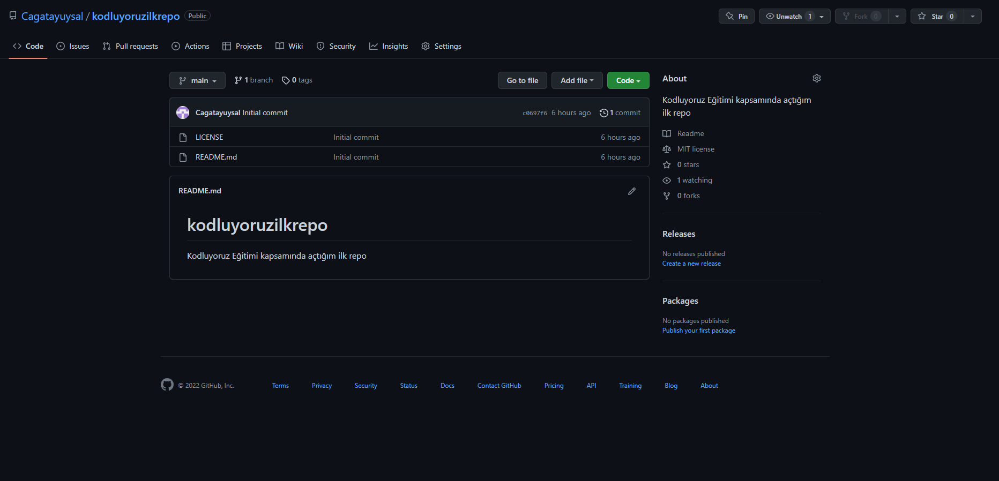

# ***Kodluyoruz İlk Repo***




---
Bu repo [Kodluyoruz](https://www.kodluyoruz.org/) Front-end eğitiminde oluşturduğumuz ilk repo. İçerisinde bir adet

README dosyası, bir adet de index.html barındırıyor.


#### ***Installation***
---
Öncelikle projeyi clonelayın.(Buraya sizin reponuzdan aldığınız link gelecek)

```
git clone https://github.com/Cagatayuysal/kodluyoruzilkrepo
```
[Github](https://github.com/Cagatayuysal/kodluyoruzilkrepo)

------------------

#### ***Usage***
Projeyi cloneladıktan sonra Visual Studio Code programı içinde açınız

Linux için:

```
cd Kodluyoruzilkrepo
code .
```
--------------------------

#### ***Contributing***

Pull requestler kabul edilir. Büyük değişiklikler için, lütfen önce neyi değiştirmek istediğinizi tartışmak için bir konu açınız.

-----------------------
#### ***License***

[MIT]()


----------------------


[Patika Profilim.](https://app.patika.dev/dopcagatay)
